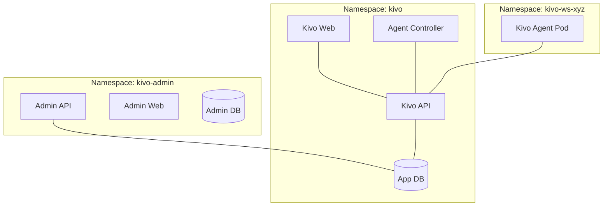

# Kivo Kubernetes Architecture

This document describes the two-plane architecture of the Kivo platform.

## 🏗 High-Level View

The system is split into the **Control Plane** (central management) and the **Application Plane** (tenant workloads).

---

## ── Application Plane (The Heart) ─────────────────────────────────────────────

Located in the `kivo` namespace. It hosts the core services that users interact with.

1.  **`kivo-api`:** The primary REST backend.
2.  **`kivo-web`:** The client-facing dashboard.
3.  **`kivo-agent-controller`:** A custom Kubernetes Operator that watches for `Agent` resources and manages the lifecycle of agent pods.

---

## ── Tenant Workloads (The Agents) ──────────────────────────────────────────────

Every workspace gets its own isolated namespace (`kivo-ws-<id>`).

1.  **Kivo Agent Pod:** Contains two containers:
    - **`kivo` (OpenClaw):** The AI brain.
    - **`kivo-consumer` (Sidecar):** The gateway. It listens for HTTP Push messages from the `kivo-api` and routes them to the agent brain.

### Communication Flow (Direct Push)
- **Outbound:** When a user sends a message, `kivo-api` discovers the agent's Pod IP via the Controller and makes a direct HTTP POST request to the sidecar.
- **Inbound:** When the agent replies, the sidecar makes a direct HTTP POST request back to the `kivo-api` internal endpoint.

---

## 🛡️ Security & Isolation

- **Namespace Isolation:** Agents run in dedicated namespaces with restricted ServiceAccounts.
- **Network Policies:** Strict rules prevent agents from talking to anything except the `kivo-api`.
- **Token Authentication:** Every inter-service communication requires an `INTERNAL_SERVICE_TOKEN`.
- **Brokerless:** By removing centralized message brokers (RabbitMQ), we reduced the attack surface and simplified tenant data isolation.
